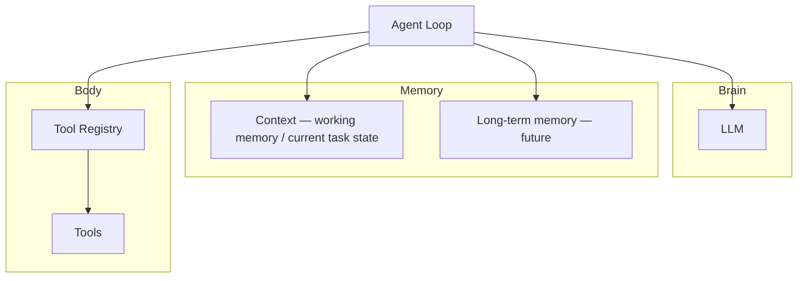
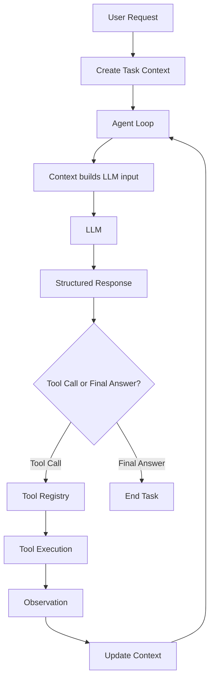

# ClaudeCode-From-Scratch

> Reverse Engineering Claude Code Through First Principles

## Project Vision

Mini Claude Code is a runnable educational coding agent. It reconstructs the core architecture of a coding agent by deriving each major design decision from first principles, rather than copying Claude Code internals.

The goal is to understand **why** coding agents are designed the way they are — by making and defending each design choice independently before validating it against production systems.

## Agent Blueprint

> An agent is fundamentally an execution loop that coordinates reasoning, memory, and execution until a task is complete.

The LLM is not the whole agent. The Agent Loop coordinates all systems:



## Agent Execution Loop



- One user request is treated as one task in v1.
- One task owns one Context.
- Multiple loop iterations update the same Context.
- Context represents the working state of the current task.
- `build_messages()` assembles that working state into input the LLM can consume.

## First Principles Map

Four principles guide every architectural decision in this project:

| Principle | Description | Related Terms |
|---|---|---|
| **Hide Change** | Localize likely changes so they do not propagate through the system | Encapsulation, information hiding, Open-Closed Principle |
| **Single Responsibility** | Each component owns one clear responsibility | Separation of Concerns, SRP |
| **Depend on Stable Abstractions** | Components depend on stable capabilities, not concrete implementations | Dependency Inversion, Dependency Injection, decoupling |
| **Minimize Information** | Acquire, process, and retain only the minimum sufficient information for the next decision | Incremental discovery, context engineering, YAGNI, cost-aware design |

How the current architecture applies these principles:

| Component | Principle(s) |
|---|---|
| Repository Discovery | Minimize Information |
| Tool Registry | Hide Change + Single Responsibility |
| Agent Loop | Single Responsibility |
| Dependency Injection | Depend on Stable Abstractions |
| Context | Hide Change + Minimize Information |
| Structured Protocol | Single Responsibility |

## Current Architecture

```
src/
├── main.py              # entry point
├── agent_loop.py        # core agent loop — orchestration only
├── llm_client.py        # LLM API wrapper
├── context.py           # context window management
├── session.py           # per-run session state
├── prompts.py           # system prompt and templates
└── tools/
    ├── base.py          # base class for all tools
    ├── file_tools.py    # file read/write tools
    ├── search_tools.py  # grep and find tools
    └── command_tools.py # shell command tools
```

## ADR Index

| ADR | Title | Status |
|---|---|---|
| [ADR-001](docs/adr/001-repository-discovery.md) | Repository Discovery | Accepted |
| [ADR-002](docs/adr/002-tool-registry.md) | Tool Registry | Accepted |
| [ADR-003](docs/adr/003-agent-loop.md) | Agent Loop | Accepted |

## Roadmap

### Phase 1 — Agent Kernel

- [x] Repository Discovery
- [x] Tool Registry
- [x] Agent Loop
- [ ] Context — *next*
- [ ] Structured Protocol

### Phase 2 — Coding Runtime

- [ ] read_file
- [ ] write_file
- [ ] edit_file
- [ ] grep
- [ ] glob
- [ ] bash
- [ ] Tool errors returned as observations
- [ ] read → edit → test → retry workflow

### Phase 3 — Product and Reliability

- [ ] Real LLM client
- [ ] System prompt
- [ ] CLI / REPL
- [ ] Configuration
- [ ] Session save and resume
- [ ] Basic context compaction
- [ ] Safety confirmation for risky actions
- [ ] End-to-end demo
- [ ] README polish

Advanced planning, reflection, sub-agents, and parallel tool execution are optional extensions, not baseline requirements.

## Current Status

Phase 1 in progress. Repository Discovery, Tool Registry, and Agent Loop are complete. Context and Structured Protocol are next.
