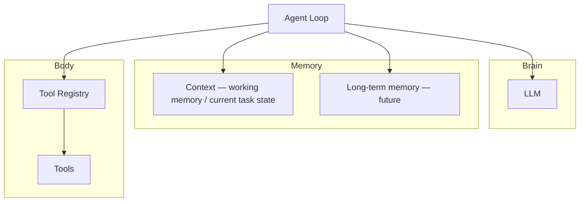
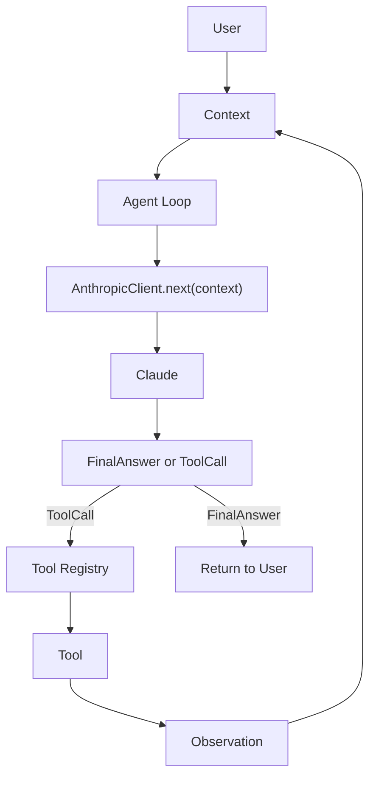

# ClaudeCode-From-Scratch

> Reverse Engineering Claude Code Through First Principles

## Project Vision

Mini Claude Code is a runnable educational coding agent. It reconstructs the core architecture of a coding agent by deriving each major design decision from first principles, rather than copying Claude Code internals.

The goal is to understand **why** coding agents are designed the way they are — by making and defending each design choice independently before validating it against production systems.

## Agent Blueprint

> An agent is fundamentally an execution loop that coordinates reasoning, memory, and execution until a task is complete.

The LLM is not the whole agent. The Agent Loop coordinates all systems:



## Agent Execution Loop



- One user request is treated as one task in v1.
- One task owns one `Context`.
- `AgentLoop.run()` repeatedly calls `AnthropicClient.next(context)` until it gets back a `FinalAnswer`.
- `next()` translates Claude's raw response into the internal protocol (`FinalAnswer` / `ToolCall`) defined in ADR-005 — the loop never sees a provider-specific shape.
- A `ToolCall` carries a `call_id`; `Context.add_tool_result()` stores the tool's output keyed to that `call_id` so it can be replayed as a paired `tool_use`/`tool_result` on the next round.
- `Context.build_messages()` assembles the running conversation (including past tool results) into the input Claude sees next.

## First Principles Map

Four principles guide every architectural decision in this project:

| Principle | Description | Related Terms |
|---|---|---|
| **Hide Change** | Localize likely changes so they do not propagate through the system | Encapsulation, information hiding, Open-Closed Principle |
| **Single Responsibility** | Each component owns one clear responsibility | Separation of Concerns, SRP |
| **Depend on Stable Abstractions** | Components depend on stable capabilities, not concrete implementations | Dependency Inversion, Dependency Injection, decoupling |
| **Minimize Information** | Acquire, process, and retain only the minimum sufficient information for the next decision | Incremental discovery, context engineering, YAGNI, cost-aware design |

How the current architecture applies these principles:

| Component | Principle(s) |
|---|---|
| Repository Discovery | Minimize Information |
| Tool Registry | Hide Change + Single Responsibility |
| Agent Loop | Single Responsibility |
| Dependency Injection | Depend on Stable Abstractions |
| Context | Hide Change + Minimize Information |
| Structured Protocol | Single Responsibility |

## Current Architecture

```
src/
├── main.py              # entry point
├── agent_loop.py        # core agent loop — orchestration only
├── llm_client.py        # LLM API wrapper
├── context.py           # context window management
├── session.py           # per-run session state
├── prompts.py           # system prompt and templates
└── tools/
    ├── base.py          # base class for all tools
    ├── file_tools.py    # file read/write tools
    ├── search_tools.py  # grep and find tools
    └── command_tools.py # shell command tools
```

## ADR Index

| ADR | Title | Status |
|---|---|---|
| [ADR-001](docs/adr/001-repository-discovery.md) | Repository Discovery | Accepted |
| [ADR-002](docs/adr/002-tool-registry.md) | Tool Registry | Accepted |
| [ADR-003](docs/adr/003-agent-loop.md) | Agent Loop | Accepted |
| [ADR-004](docs/adr/004-context.md) | Context | Accepted |
| [ADR-005](docs/adr/005-internal-communication-protocol.md) | Internal Communication Protocol | Accepted |

## Roadmap

## Roadmap

claude-code-from-scratch

### Phase 1 — Agent Kernel

- [x] Repository Discovery
- [x] Tool Registry
- [x] Agent Loop
- [x] Context
- [x] Structured Protocol (`FinalAnswer` / `ToolCall`)
- [x] Real LLM integration

**Milestone:** a real LLM can reason through our own agent architecture.

---

### Phase 2 — Coding Agent

- [x] Tool schemas exposed to Claude
- [x] `list_files`
- [x] `read_file`
- [x] `run_tests`
- [x] Multi-tool autonomous reasoning — Claude chooses among `list_files` / `read_file` / `run_tests` and sequences multiple tool calls itself, in no fixed order
- [ ] `edit_file`
- [ ] `grep` / `glob`
- [ ] Tool errors as observations
- [ ] Multi-step `read → edit → test → retry` workflow

**Milestone:** Claude can autonomously inspect, modify, and verify a codebase.

---

### Phase 3 — Usable Agent

- [ ] System prompt
- [ ] CLI / interactive session
- [ ] Session save and resume
- [ ] Context compaction
- [ ] Safety confirmation for risky actions
- [ ] End-to-end coding demo

**Milestone:** turn the agent engine into a usable coding assistant.

---

### Phase 4 — Memory & Retrieval

- [ ] Working context vs. persistent memory
- [ ] Session / repository memory
- [ ] Memory retrieval
- [ ] Embeddings and semantic retrieval
- [ ] Lightweight RAG for repository knowledge

**Milestone:** the agent can retain and retrieve useful information across longer tasks.

---

### Phase 5 — Evaluation & Reliability

- [ ] Coding-task eval set
- [ ] End-to-end task success evaluation
- [ ] Test / repair success rate
- [ ] Tool-call and trajectory evaluation
- [ ] Token, latency, and cost tracking
- [ ] Regression evals
- [ ] Basic tracing / observability
- [ ] Retry, timeout, and failure handling

**Milestone:** improvements to the agent become measurable instead of subjective.

---

### Phase 6 — Production

- [ ] Configuration and secrets management
- [ ] CI for tests and evals
- [ ] Containerization
- [ ] Cloud deployment
- [ ] Production logging / monitoring

**Milestone:** deploy and operate the agent as a real system.

---

## Learning Extensions

These are explored only when they solve a real problem in the project:

- Vector databases
- LangGraph / graph orchestration
- Advanced RAG
- Model routing
- Fine-tuning

The goal is not to add technologies for their own sake, but to understand
when and why they become useful.

Advanced planning, reflection, sub-agents, and parallel tool execution are optional extensions, not baseline requirements.

## Current Status

Phase 1 (Agent Kernel) is complete: Repository Discovery, Tool Registry, Agent Loop, Context, and the ADR-005 typed internal protocol are all implemented.

Phase 2 (Coding Runtime) is underway. A real `AnthropicClient` is wired into `AgentLoop`, the tool schema is exposed to Claude, and `list_files`, `read_file`, and `run_tests` all run as a full tool-use loop end to end: Claude issues a `ToolCall` (with a `call_id`) for whichever tool it chooses, the `ToolRegistry` executes it, and the result is stored in `Context` and replayed on the next round. Claude autonomously sequences multiple different tool calls — in whatever order it decides — before producing a `FinalAnswer`; no sequence is hardcoded.

61/61 tests pass. `edit_file` is the next capability, aimed at a real read → edit → test coding workflow.
